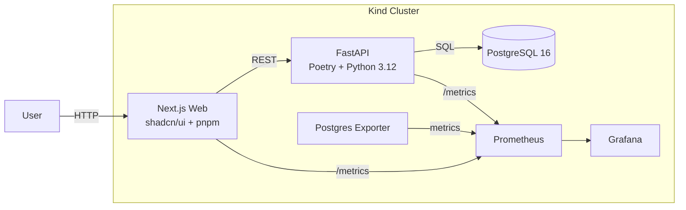

# vibecheck

> *"Pineapple on pizza?" — a real-time polling platform deployed on Kubernetes with Terraform*

## Architecture



## Tech Stack

| Layer | Technology |
|-------|-----------|
| **Frontend** | Next.js 15 + TypeScript + Tailwind CSS + shadcn/ui + pnpm |
| **Backend** | FastAPI + Python 3.12 + Poetry |
| **Database** | PostgreSQL 16 |
| **IaC** | Terraform with reusable modules |
| **Container** | Docker multi-stage builds (non-root) |
| **Orchestration** | Kubernetes (Kind for local) |
| **Monitoring** | Prometheus + Grafana + postgres-exporter |
| **CI/CD** | GitHub Actions (lint + Trivy scan + Terraform validate) |
| **Security** | Kyverno policies (no privileged, require labels, require resource limits) |
| **Scaling** | HPA on CPU utilization |

## Quick Start

### Prerequisites

- [Docker](https://www.docker.com/)
- [Kind](https://kind.sigs.k8s.io/)
- [kubectl](https://kubernetes.io/docs/tasks/tools/)
- [Terraform](https://www.terraform.io/)

### Deploy

```bash
git clone https://github.com/jmunozti/vibecheck.git
cd vibecheck
make deploy
```

This will:
1. Build Docker images for API and Web (multi-stage, non-root)
2. Create a Kind cluster with port mappings
3. Load images into the cluster
4. Apply Terraform to deploy all services

### Access

| Service | URL |
|---------|-----|
| Web UI | http://localhost:30080 |
| API | http://localhost:30501 |
| Grafana | http://localhost:30030 |

### Check status

```bash
make status
```

### Cleanup

```bash
make clean
```

## Project Structure

```
vibecheck/
├── api/                          # FastAPI backend
│   ├── app.py                    # Endpoints: /poll, /results, /healthz
│   ├── pyproject.toml            # Poetry dependencies
│   └── Dockerfile                # Multi-stage, non-root
├── web/                          # Next.js frontend
│   ├── src/
│   │   ├── app/                  # App Router pages + API routes
│   │   └── components/
│   │       └── poll-card.tsx     # Main polling UI (shadcn/ui)
│   └── Dockerfile                # Multi-stage, standalone output
├── terraform/                    # Infrastructure as Code
│   ├── main.tf                   # All modules wired together
│   ├── modules/
│   │   ├── deployment/           # Reusable K8s deployment module
│   │   ├── service/              # Reusable K8s service module
│   │   ├── config-map/           # ConfigMap from .env files
│   │   └── kubernetes-namespace/
│   └── outputs.tf
├── k8s/
│   ├── hpa.yaml                  # HorizontalPodAutoscaler for API and Web
│   └── policies/
│       ├── deny-privileged.yaml  # Kyverno: no privileged containers
│       ├── require-labels.yaml   # Kyverno: require app label
│       └── require-resources.yaml # Kyverno: require CPU/memory limits
├── .github/workflows/ci.yml     # Lint + Trivy scan + Terraform validate
├── deploy-local.sh              # One-command local deployment
└── Makefile                     # make deploy / make status / make clean
```

## Security

- Docker images run as **non-root** users
- No hardcoded credentials — all secrets via `.env` files (gitignored)
- **Trivy** scans both images for CRITICAL/HIGH CVEs in CI
- **Kyverno** policies enforce:
  - No privileged containers
  - Required `app` label on all deployments
  - CPU/memory limits on all pods
- **Terraform validate** runs in CI to catch IaC errors

## Monitoring

- **Prometheus** scrapes metrics from API, Web, and postgres-exporter
- **Grafana** provides dashboards for PostgreSQL health and application metrics
- Both API (FastAPI) and Web (Next.js) expose `/metrics` endpoints

## License

MIT
