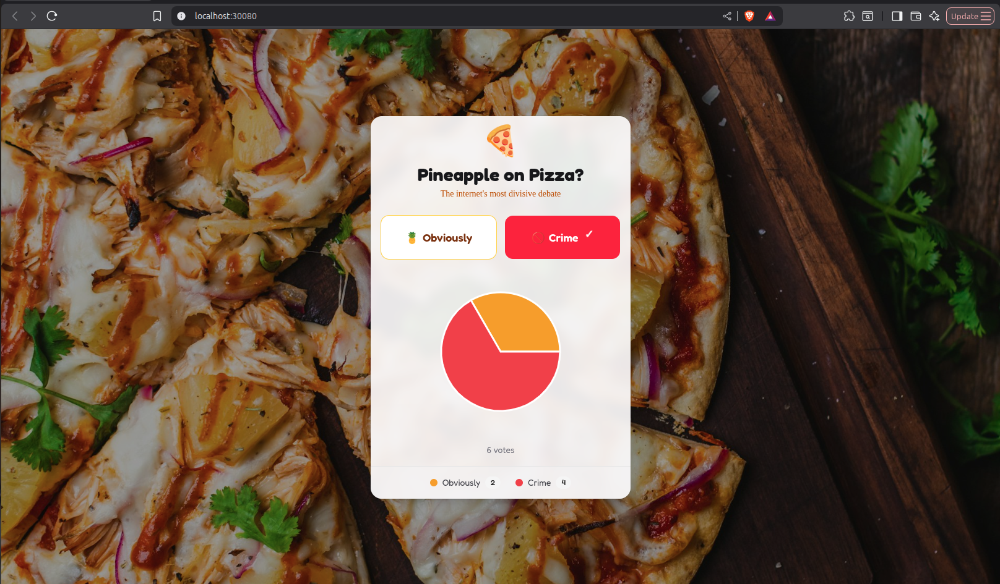
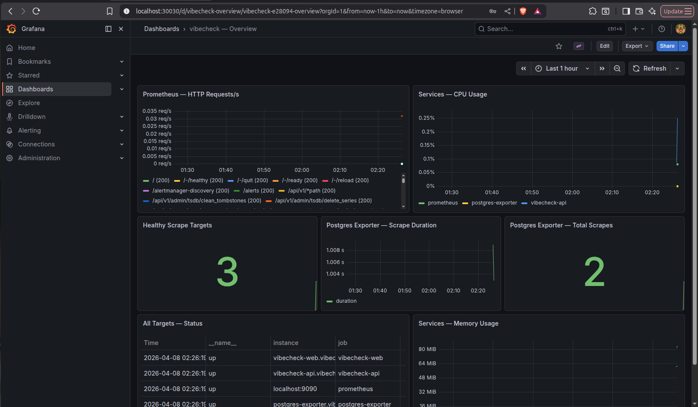
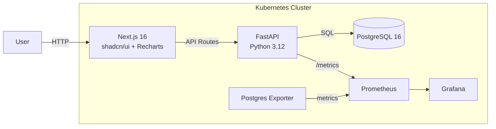

<p align="center">
  
</p>

# vibecheck 🍕

> Pineapple on pizza? Cast your vote. See results in real-time.

A full-stack polling app built to demonstrate how modern microservices are deployed, monitored, and secured on Kubernetes — from code to cluster with one command.

| App | Grafana Dashboard |
|-----|-------------------|
|  |  |

## Why This Project

This isn't just a poll app. It's a production-grade deployment that shows:

- **Infrastructure as Code** — Terraform modules provision the entire cluster
- **Docker best practices** — Multi-stage builds, non-root users, minimal images
- **CI/CD pipeline** — Lint, test, security scan, and validate on every push
- **Observability** — Prometheus scraping metrics, Grafana with auto-provisioned dashboards
- **Security policies** — Kyverno enforcing no privileged containers, required labels, resource limits
- **Auto-scaling** — HPA scaling pods based on CPU utilization

Everything a DevOps/SRE engineer deals with daily, in one repo.

## Run It

```bash
git clone https://github.com/jmunozti/vibecheck.git
cd vibecheck
make deploy
```

Done. Open http://localhost:30080 and vote.

| Service | URL | Credentials |
|---------|-----|-------------|
| Web UI | http://localhost:30080 | — |
| API | http://localhost:30501 | — |
| Grafana | http://localhost:30030 | admin / changeme |
| Prometheus | http://localhost:30900 | — |

Other commands:

```bash
make status     # Show pods and services
make test       # Run backend tests
make lint       # Run backend linter
make clean      # Tear everything down
```

## What `make deploy` Does

1. Generates `.env` files from templates (no secrets in git)
2. Builds two Docker images (FastAPI + Next.js) with multi-stage builds
3. Creates a local Kubernetes cluster with Kind
4. Loads images into the cluster
5. Runs `terraform apply` to deploy 6 services: Web, API, PostgreSQL, Prometheus, Grafana, postgres-exporter

## Architecture



## Tech Stack

| | Technology |
|--|-----------|
| Frontend | Next.js 16, TypeScript, Tailwind CSS, shadcn/ui, Recharts, pnpm |
| Backend | FastAPI, Python 3.12, Poetry, connection pooling |
| Database | PostgreSQL 16 |
| IaC | Terraform (reusable modules, v1 resources, required_providers) |
| Containers | Docker multi-stage builds, non-root, .dockerignore |
| Orchestration | Kubernetes (Kind) |
| Monitoring | Prometheus + Grafana (auto-provisioned dashboard) + postgres-exporter |
| CI/CD | GitHub Actions: ruff + pytest + Trivy + terraform validate |
| Security | Kyverno policies, Trivy CVE scanning, liveness/readiness probes, resource limits |
| Scaling | HPA on CPU (API: 2-10 pods, Web: 2-5 pods) |

## CI/CD

Every push to `main` or `develop` triggers 4 parallel jobs:

| Job | What it does |
|-----|-------------|
| lint-backend | Ruff lint + 5 pytest tests |
| scan-backend | Builds image, Trivy scans for CVEs |
| scan-frontend | Builds image, Trivy scans for CVEs |
| terraform-validate | Validates IaC syntax |

## Prerequisites

- [Docker](https://www.docker.com/)
- [Kind](https://kind.sigs.k8s.io/)
- [kubectl](https://kubernetes.io/docs/tasks/tools/)
- [Terraform](https://www.terraform.io/)

## License

MIT
